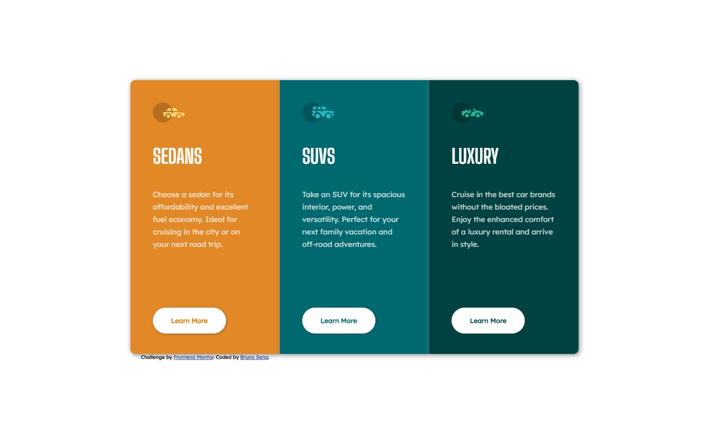

# Frontend Mentor - 3-column preview card component solution

This is a solution to the [3-column preview card component challenge on Frontend Mentor](https://www.frontendmentor.io/challenges/3column-preview-card-component-pH92eAR2-). Frontend Mentor challenges help you improve your coding skills by building realistic projects. 

## Table of contents

- [Overview](#overview)
  - [The challenge](#the-challenge)
  - [Screenshot](#screenshot)
  - [Links](#links)
- [My process](#my-process)
  - [Built with](#built-with)
  - [What I learned](#what-i-learned)
  - [Continued development](#continued-development)
- [Author](#author)

## Overview

### The challenge

Users should be able to:

- View the optimal layout depending on their device's screen size
- See hover states for interactive elements

### Screenshot

### Links

- Solution URL: [Solution](https://github.com/brujavsen/3-column-preview-card-bruno)
- Live Site URL: [GitHub Pages](https://brujavsen.github.io/3-column-preview-card-bruno/)

## My process

### Built with

- Semantic HTML5 markup
- CSS custom properties
- Flexbox
- CSS Grid
- Mobile-first workflow

### What I learned

It wasn't that complicated of a challenge, but I did have to be thorough with some details that came out disproportionately when writing the styles. I'm proud of the shading I add to the card and buttons. When I used Grid Layout everything was easier to combine.

### Continued development

I have improved a lot with Grid-Layout and Flexbox, before I could not distinguish their properties and it was all by luck, now I can better understand each of their functions. So this project was easier for me to execute, but I still think the design can be further improved and I want to learn.

## Author

- Frontend Mentor - [@brujavsen](https://www.frontendmentor.io/profile/brujavsen)
- GitHub - [@brujavsen](https://github.com/brujavsen)